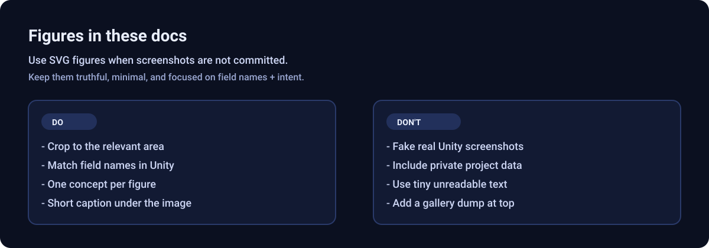

# ReactiveVars — documentation

Inspector-first data binding, events, tweens, and sequencing for Unity. This folder is the **documentation home** for the package (Unity hides `Documentation~` from the asset database).

**Repository / package root:** see the [README](../README.md) for badges, install URLs, and support links.

---

## Where do I start?

- **Designer / level / UI:** Read **[Getting Started](GettingStarted.md)** (5 minutes), then **[Recipes](Recipes.md)** for copy-paste setups. Use **[Glossary](Glossary.md)** when a term is unclear. Stuck? **[FAQ](FAQ.md)**.
- **Programmer:** Skim Getting Started, then **[ScriptableVariable reference](ScriptableVariable.md)** and **[Reference for programmers](Reference.md)** (assemblies, architecture, driver/binder tables, UniRx notes).

---

## Most common tasks

- **Create a shared value**: [GettingStarted.md](GettingStarted.md) → “Create a Variable”
- **Show it on UI**: [GettingStarted.md](GettingStarted.md) → “Setting Up Your First Binder”
- **Feed it from scene logic** (timers, distance, input): [GettingStarted.md](GettingStarted.md) → “Setting Up Your First Driver” + [Recipes.md](Recipes.md)
- **Watch/edit values in Play mode**: this page → “Reactive Vars window (editor)”
- **Smoothly animate values**: [TweenSystem.md](TweenSystem.md)
- **Save/load groups**: [VariableContainer.md](VariableContainer.md)
- **Build tutorials / cutscenes**: [SequencingSystem.md](SequencingSystem.md)

---

## Five-minute path (first win)

1. Create a **FloatVariable** (see Create menu paths in [Glossary](Glossary.md)).
2. Add **NumericalTextBinder** to a TextMeshPro object; assign the variable.
3. Change the variable’s value in the inspector during Play mode — text updates.

Optional: add a **TimerDriver** and another binder to the same float for a countdown with no code ([Recipes](Recipes.md)).

---

## Reactive Vars window (editor)

Open **Shababeek > ReactiveVars > Reactive Vars Window** for a dockable **Reactive Vars** view. It lists **Variables** and **Events** from your project, grouped by asset, with search, type filter, and **Scene Refs Only** (default on: only assets referenced in the open scenes). In **Play mode**, edit **int / float / bool / string** values inline; the **Events** tab can **Fire** events for quick testing. Turn off **Scene Refs Only** to browse everything. See [Glossary](Glossary.md) and [Reference.md](Reference.md) for details.

Runtime on-screen listing (play mode only): **VariableDebugOverlay** component — separate from this editor window.

---

## Screenshots and figures

This repo keeps documentation visuals under `Documentation~/images/` and embeds them with relative links like:

``

Guidelines:

- Prefer **small, cropped** visuals focused on one concept (one inspector/window area).
- Use **neutral example names** (e.g., `PlayerHealth`, `RoundTimer`).
- Use **SVG figures** when a real screenshot is not available in-repo.

Style reference figure:

---

## Table of contents

| #   | Guide                                             | Who it’s for                             |
| --- | ------------------------------------------------- | ---------------------------------------- |
| 1   | [Getting Started](GettingStarted.md)              | Everyone — concepts + first binder       |
| 2   | [Recipes](Recipes.md)                             | Designers — common scene setups          |
| 3   | [Glossary](Glossary.md)                           | Everyone — terminology                   |
| 4   | [Binders](Binders.md)                             | Detailed binder catalog + custom binders |
| 5   | [Tween System](TweenSystem.md)                    | Smooth value animation                   |
| 6   | [Variable Containers](VariableContainer.md)       | Grouping assets, save/load               |
| 7   | [Sequencing](SequencingSystem.md)                 | Linear and branching flows               |
| 8   | [FAQ / Troubleshooting](FAQ.md)                   | Common problems                          |
| 9   | [ScriptableVariable (API)](ScriptableVariable.md) | Programmers — members, numerical API     |
| 10  | [Reference (programmers)](Reference.md)           | Architecture, tables, source map         |

---

## Troubleshooting

Central index: **[FAQ.md](FAQ.md)**. Individual guides also include troubleshooting sections at the end.

---

## Contributing

[CONTRIBUTING.md](../CONTRIBUTING.md) — assemblies, tests, optional Input System define.