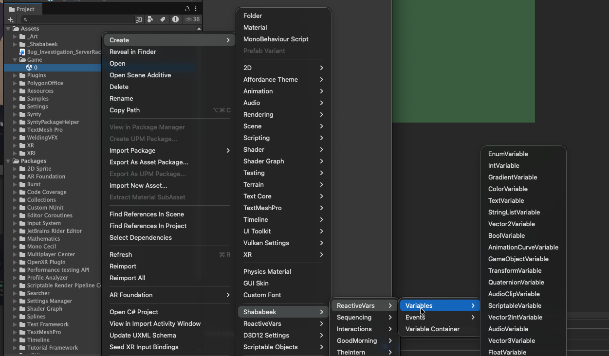
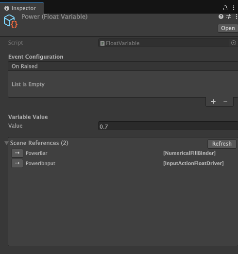

# ScriptableVariable\<T\> — Reference

## What Is a ScriptableVariable?

A ScriptableVariable is a shared value that lives as a project asset. Any component in any scene can read it, write to it, or react when it changes — without those components knowing about each other.

Think of it like a shared whiteboard: one system writes a number on it, and anyone else watching the whiteboard sees the update instantly.

## When to Use

Use a ScriptableVariable whenever two or more objects need to share a piece of data. Common examples: player health, current score, selected weapon index, UI toggle states, timer values.

## Creating Variables

Right-click in the Project window: **Create > ReactiveVars > Variables** and pick a type (FloatVariable, IntVariable, BoolVariable, etc.). Give it a descriptive name like `PlayerHealth` or `CurrentScore`.





## API

| Member | Description |
|---|---|
| `T Value` | Get/set the stored value. Setting raises all events and notifies all subscribers. |
| `IObservable<T> OnValueChanged` | Typed reactive stream — fires with the new value on every change. |
| `IObservable<Unit> OnRaised` | Untyped notification — fires on any change (inherited from `GameEvent`). |
| `void SetValueWithoutNotify(T)` | Sets the value silently — no events, no subscribers notified. Use when a driver or tween is pushing values every frame and you want to avoid per-frame event overhead. Pair with Poll mode binders on the read side. |
| `void Raise()` | Manually notify all subscribers of the current value. |
| `void Raise(T data)` | Notify subscribers with a specific value. |
| `void Init(T value)` | Set the value without raising events. Intended for initialization. |
| `void Reset()` | Reset the value to `default(T)` without raising events. |
| `void Reset(T value)` | Reset to a specific value without raising events. |

## Numerical Variables

`FloatVariable` and `IntVariable` extend `NumericalVariable<T>` and implement the `INumericalVariable` interface. This gives them type-agnostic numeric operations that binders and tweenables can use without knowing the concrete type:

| Member | Description |
|---|---|
| `float AsFloat` | Current value as a float. |
| `int AsInt` | Current value as an integer. |
| `void SetFromFloat(float)` | Set from a float (IntVariable rounds). |
| `void SetFromFloatWithoutNotify(float)` | Silent version — no events fired. Used by TweenableNumerical during interpolation. |
| `void Add(float)` | Add to the current value. |
| `void Subtract(float)` | Subtract from the current value. |
| `void Multiply(float)` | Multiply the current value. |
| `void Divide(float)` | Divide the current value (safe — warns on zero). |
| `void Clamp(float min, float max)` | Clamp to a range. |
| `float GetNormalized(float min, float max)` | Returns 0–1 position within the range. |
| `void SetFromNormalized(float, float min, float max)` | Sets from a 0–1 value within the range. |
| `void LerpTo(float target, float t)` | Interpolate toward a target. |
| `void MoveTowards(float target, float maxDelta)` | Move toward a target by a max step. |

## Example

```csharp
public FloatVariable playerHealth;

void Start()
{
    // React to changes
    playerHealth.OnValueChanged.Subscribe(hp => Debug.Log($"Health: {hp}"));
}

void TakeDamage(float amount)
{
    playerHealth.Value -= amount;  // All subscribers notified
}

void SilentReset()
{
    playerHealth.SetValueWithoutNotify(100f);  // No events — use Poll mode binders to read
}
```

## Inheritance

```
ScriptableObject
 └─ GameEvent                         OnRaised observable
     └─ GameEvent<T>                  typed event payload
         └─ ScriptableVariable        abstract base (ToString, SetValue, GetValue)
             └─ ScriptableVariable<T> Value, OnValueChanged, SetValueWithoutNotify
                  ├─ NumericalVariable<T> : INumericalVariable
                  │   ├─ FloatVariable
                  │   └─ IntVariable
                  ├─ BoolVariable
                  ├─ ColorVariable
                  ├─ Vector2Variable
                  ├─ Vector3Variable
                  ├─ Vector2IntVariable
                  ├─ QuaternionVariable
                  ├─ TextVariable
                  ├─ StringListVariable
                  ├─ EnumVariable
                  ├─ LayerMaskVariable
                  ├─ TransformVariable
                  ├─ GameObjectVariable
                  ├─ AudioVariable
                  ├─ AudioClipVariable
                  ├─ GradientVariable
                  ├─ AnimationCurveVariable
                  ├─ SpriteVariable
                  ├─ MaterialVariable
                  └─ DoubleVariable
```

## Related

- **VariableReference\<T\>** — Dual-mode reference that can hold a constant value or point to a variable asset. Useful for prototyping with constants and swapping to shared variables later. See `VariableReference.cs`.
- **NumericalReference** — Numeric-only reference accepting Float or Int. See `NumericalReference.cs`.
- **VariableContainer** — Groups related variables into a single asset for organization, saving, loading, and bulk reset. See `VariableContainer.cs`.
- **VariableBinder\<T\>** — Base class for components that read from a variable and update scene objects. See `VariableBinder.cs`.
- **VariableDriver\<T\>** — Base class for components that write into a variable from external sources. See `VariableDriver.cs`.
- **TweenableNumerical** — Smoothly tweens any INumericalVariable over time. See `TweenableNumerical.cs`.
- **VariableExtensions** — Reactive extension methods (WhenTrue, WhenAbove, Throttled, etc.). See `VariableExtensions.cs`.
- **BranchCondition** — Used by the Sequencing System to evaluate variable comparisons for branching transitions. See `BranchCondition.cs`.
