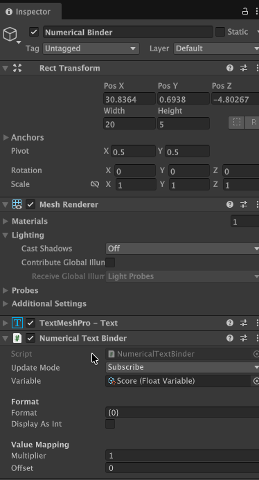
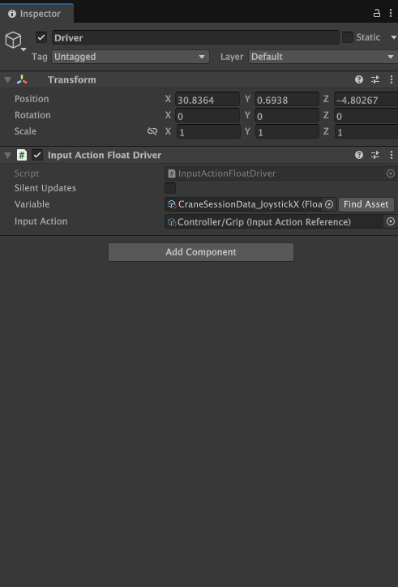
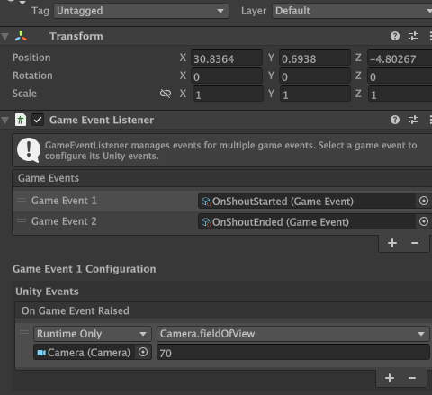
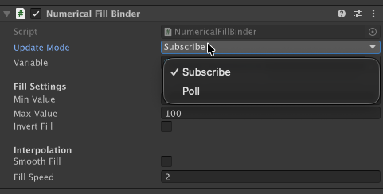
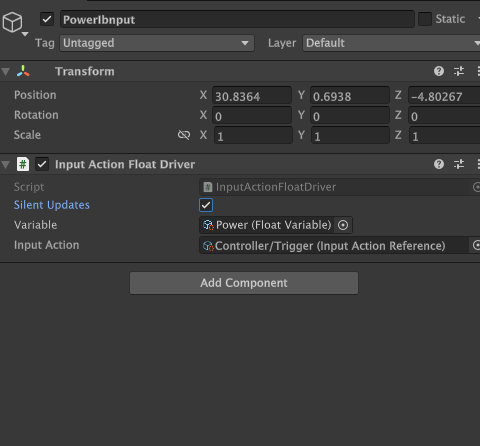

<p align="center">
  <h1 align="center">ReactiveVars</h1>
  <p align="center">
    A ScriptableObject-based reactive variable system for Unity.<br/>
    Decouple your game systems. Wire everything in the inspector.
  </p>
</p>

<p align="center">
  
  
  
  
  
</p>

---

## What Is ReactiveVars?

ReactiveVars lets you build game systems that talk to each other without being directly connected. Instead of one script finding another script to read its data, both scripts point to the same **Variable** asset — a small file that lives in your Project folder. When one script changes the variable, anything watching it updates automatically.

This means you can build things like health bars, score displays, sound effects, and UI toggles without writing code or creating complex chains of references between objects.

### Core Concepts at a Glance

| Concept | What It Does | Who Uses It |
|---|---|---|
| **Variable** | A shared value (number, bool, color, etc.) that lives as a project asset | Everyone — the foundation of the system |
| **Binder** | Reads a variable and pushes the value into a component (text, image, animator, etc.) | Designers — drag a variable onto a binder, done |
| **Driver** | Writes into a variable from a source (input, physics, timer, distance, etc.) | Designers — feeds data into the system |
| **Tween** | Smoothly interpolates a variable's value over time | Designers/Programmers — smooth transitions |
| **Event** | A signal with no permanent state — fire and forget | Everyone — trigger responses to moments |
| **Sequence** | An ordered series of steps that execute one after another, with optional branching | Designers — tutorials, cutscenes, guided flows |

### How It Fits Together

A typical setup looks like this: a **Driver** writes a value (say, the player's health) into a **Variable**. One or more **Binders** on completely separate objects read that variable and update their components (a health bar fills, a warning sound plays, a screen effect activates). Nobody knows about anyone else — they only know about the shared variable.

For more complex flows like tutorials or narrative sequences, the **Sequencing System** lets you define ordered steps with audio, events, and completion conditions — all wired in the inspector.

## Table of Contents

- [Installation](#installation)
- [Quick Start](#quick-start)
- [Variables](#variables)
- [Variable References](#variable-references)
- [Events](#events)
- [Binders (Read)](#binders-read)
- [Drivers (Write)](#drivers-write)
- [Sequencing System](#sequencing-system)
- [Tween System](#tween-system)
- [Variable Containers](#variable-containers)
- [Utilities](#utilities)
- [Editor Tools](#editor-tools)
- [Architecture](#architecture)

---

## Installation

**Via Git URL** — In Unity Package Manager, click `+` > *Add package from git URL*:

```
https://github.com/Ahmadabobakr/ReactiveVars.git
```

**Via local folder** — Clone or copy the `ReactiveVars` folder into your project's `Packages` directory.

**Dependencies:** UniRx, TextMeshPro (auto-resolved).
**Optional:** Unity Input System — input action drivers are enabled automatically when the package is detected.

---

## Quick Start

### For Designers (No Code)

1. **Create a variable:** Right-click in Project > *Create > ReactiveVars > Variables > FloatVariable*. Name it something descriptive like `PlayerHealth`.


2. **Display it:** Add a `NumericalTextBinder` component to a TextMeshPro object. Drag your variable into the slot. The text now shows the variable's value and updates automatically whenever it changes.



3. **Feed it data:** Add a driver component to a relevant object (e.g., a `TimerDriver` to count down, or a `DistanceDriver` to track distance between objects). Assign the same variable. The driver writes, the binder reads — no wiring between objects needed.



The 50+ included binders and 12 built-in drivers cover most common use cases without writing a single line of code.

### For Programmers

```csharp
public FloatVariable playerHealth;  // Drag the asset into this field in the inspector

void TakeDamage(float amount) => playerHealth.Value -= amount;  // All subscribers notified

// Meanwhile, binders on completely separate objects update automatically.
// No GetComponent. No Find. No event registration.
```

---

## Variables

Variables are the heart of ReactiveVars. Each variable is a small asset file that holds a single value — a number, a color, a boolean, a position, etc. You create them in your Project folder and share them between any objects that need to read or write that value.

**When to use a Variable:** Whenever two or more objects need to share a piece of data without knowing about each other. Common examples: player health, score, current level, selected color, active state of a UI panel.

**How to create one:** Right-click in Project > *Create > ReactiveVars > Variables* and pick a type.


<details>
<summary><strong>For Programmers — Code API</strong></summary>

```csharp
public FloatVariable playerHealth;

void Start()
{
    // Reactive subscription
    playerHealth.OnValueChanged.Subscribe(hp => Debug.Log($"Health: {hp}"));
}

void TakeDamage(float amount)
{
    playerHealth.Value -= amount;  // Notifies all subscribers
}

void SilentReset()
{
    playerHealth.SetValueWithoutNotify(100f);  // No events fired
}
```

</details>

### 23 Variable Types

| Category | Types |
|---|---|
| **Numeric** | `FloatVariable`, `IntVariable`, `DoubleVariable` |
| **Vector** | `Vector2Variable`, `Vector3Variable`, `Vector2IntVariable`, `QuaternionVariable` |
| **Visual** | `ColorVariable`, `GradientVariable`, `SpriteVariable`, `MaterialVariable` |
| **Text** | `TextVariable`, `StringListVariable` |
| **Logic** | `BoolVariable`, `EnumVariable`, `LayerMaskVariable` |
| **Reference** | `TransformVariable`, `GameObjectVariable` |
| **Audio** | `AudioVariable`, `AudioClipVariable` |
| **Animation** | `AnimationCurveVariable` |

Numeric variables implement `INumericalVariable` for type-agnostic operations: `Add`, `Subtract`, `Multiply`, `Divide`, `Clamp`, `GetNormalized`, `SetFromNormalized`, `LerpTo`, `MoveTowards`, and `SetFromFloatWithoutNotify`.

All variables expose:

| Member | Description |
|---|---|
| `Value` | Get/set the stored value. Setting triggers all subscribers. |
| `OnValueChanged` | `IObservable<T>` — typed reactive stream. |
| `OnRaised` | `IObservable<Unit>` — fires on any change (from base `GameEvent`). |
| `SetValueWithoutNotify(T)` | Write without triggering events. Pair with Poll mode binders. |
| `Raise()` | Manually notify all subscribers of the current value. |

### Extension Methods

```csharp
using Shababeek.ReactiveVars;

// Filter streams
myBool.WhenTrue().Subscribe(_ => Debug.Log("Became true"));
myBool.WhenFalse().Subscribe(_ => Debug.Log("Became false"));

// Numerical filters
myFloat.WhenAbove(50f).Subscribe(_ => Debug.Log("Exceeded 50"));
myFloat.WhenBelow(10f).Subscribe(_ => Debug.Log("Dropped below 10"));
myFloat.WhenInRange(20f, 80f).Subscribe(_ => Debug.Log("In range"));

// Utility
myFloat.OnFloatChanged().Subscribe(v => Debug.Log($"New float: {v}"));
myVar.Throttled(TimeSpan.FromSeconds(0.5f)).Subscribe(_ => { });
myVar.Distinct().Subscribe(_ => { });  // Skip duplicate values
```

---

## Variable References

`VariableReference<T>` can point to a ScriptableVariable asset **or** hold a constant value, toggled in the inspector. Prototype with constants, swap to shared variables later — no code changes.

```csharp
public FloatReference moveSpeed;  // Inspector: [Constant ▾] 5.0  OR  [Variable ▾] → MoveSpeed asset

void Update()
{
    transform.Translate(Vector3.forward * moveSpeed * Time.deltaTime);
}
```

**Typed references:** `FloatReference`, `IntReference`, `BoolReference`, `ColorReference`, `Vector2Reference`, `Vector3Reference`, `SpriteReference`, `MaterialReference`, `DoubleReference`.

`NumericalReference` accepts either a `FloatVariable` or `IntVariable` with unified numeric access.

---

## Events

Events are signals — they notify listeners that something happened, without carrying permanent state. Unlike variables (which hold a value), events are fire-and-forget.

**When to use an Event vs a Variable:** Use a Variable when you care about the current value (health, score, position). Use an Event when you care about the moment something happens (player died, level completed, button pressed).

**How to create one:** Right-click in Project > *Create > ReactiveVars > Events > GameEvent*.

**How to listen in the scene:** Add a `GameEventListener` component to any GameObject, assign the event asset, and wire up UnityEvents in the inspector — no code needed.



| Component | What It Does |
|---|---|
| **GameEvent** | A signal with no data. Create as an asset, raise it from code or UnityEvents. |
| **GameEventListener** | Scene component that listens for a GameEvent and triggers UnityEvents in response. |
| **ObjectLifecycleEvents** | Automatically fires events when a GameObject is enabled, disabled, or destroyed. |

<details>
<summary><strong>For Programmers — Typed Events</strong></summary>

`GameEvent<T>` carries a typed data payload. Use `Raise(data)` to fire with data and subscribe via `OnRaisedData`.

```csharp
public GameEvent onPlayerDeath;

void Die() => onPlayerDeath.Raise();  // All listeners respond
```

</details>

---

## Binders (Read)

Binders are components you add to GameObjects that **read** a variable and automatically update something visual or functional — a text label, an image fill, an animator parameter, a GameObject's active state, etc. You assign the variable in the inspector and the binder handles the rest.

**When to use a Binder:** Whenever you want something in the scene to react to a variable changing. Common examples: a health bar that fills based on a health variable, text that displays a score, a door that opens when a bool is true.

**How to use:** Add a binder component to a GameObject (e.g., `NumericalTextBinder` on a TextMeshPro object), drag in a variable, and you're done.



### Update Modes

Every binder exposes an **Update Mode** dropdown:

| Mode | Behavior | Use When |
|---|---|---|
| **Subscribe** (default) | Reacts to variable change events | Normal usage — zero cost when idle |
| **Poll** | Reads the value every frame in `Update` | Variable is being tweened silently |

### Writing Custom Binders

Extend a base class. All UniRx usage is isolated in the base — your subclass stays framework-agnostic.

| Base Class | For |
|---|---|
| `VariableBinder<T>` | One variable → one target |
| `NumericalVariableBinder` | Any `INumericalVariable` |
| `TwoWayVariableBinder<T>` | Bidirectional UI sync with recursion guards |
| `VariableBinder<T1, T2>` | Two variables → one target |
| `VariableBinder<T1, T2, T3>` | Three variables → one target |

```csharp
public class HealthBarBinder : VariableBinder<FloatVariable>
{
    [SerializeField] private FloatVariable health;
    [SerializeField] private Image fillImage;

    protected override FloatVariable Variable => health;

    protected override void Bind() => OnVariableChanged();

    protected override void OnVariableChanged()
    {
        fillImage.fillAmount = health.Value / 100f;
    }
}
```

### Included Binders (50+)

<details>
<summary><strong>Numerical</strong> — position, rotation, scale, text, fill, audio, animator, particles, material, navmesh</summary>

`NumericalPositionBinder`, `NumericalRotationBinder`, `NumericalScaleBinder`, `NumericalTextBinder`, `NumericalFillBinder`, `NumericalAudioBinder`, `NumericalAnimatorBinder`, `NumericalParticleBinder`, `NumericalMaterialBinder`, `NumericalNavMeshBinder`, `NumericalPositionSpeedBinder`, `NumericalRotationSpeedBinder`, `FloatLerpPositionBinder`, `GradientSamplerBinder`, `ImageFilledBinder`

</details>

<details>
<summary><strong>Color</strong> — image, sprite, line renderer, text</summary>

`ColorImageBinder`, `ColorSpriteBinder`, `ColorLineRendererBinder`, `ColorTextMeshProBinder`

</details>

<details>
<summary><strong>Bool</strong> — toggle, animator, particles, canvas group, GameObject active, component enable</summary>

`BoolToggleBinder`, `BoolAnimatorBinder`, `BoolParticleBinder`, `BoolCanvasGroupBinder`, `GameObjectActiveBinder`, `EnableComponentBinder`

</details>

<details>
<summary><strong>Transform & Physics</strong> — transform, rigidbody, rotation, velocity, rect transform</summary>

`TransformBinder`, `TransformFollowerBinder`, `Vector3PositionBinder`, `QuaternionRotationBinder`, `Vector2SpaceBinder`, `Rigidbody3DBinder`, `Rigidbody2DBinder`, `AngularVelocityBinder`, `IntVariableRotationBinder`, `RectTransformBinder`

</details>

<details>
<summary><strong>Visual</strong> — sprite, line renderer width, material property</summary>

`SpriteRendererBinder`, `SpriteRendererFlipBinder`, `LineRendererWidthBinder`, `MaterialPropertyBinder`

</details>

<details>
<summary><strong>UI (Two-Way)</strong> — slider, dropdown, input field, scroll rect</summary>

`SliderBinder`, `DropdownBinder`, `InputFieldBinder`, `ScrollRectBinder`

</details>

<details>
<summary><strong>Other</strong> — text, camera, light, canvas group, animator, audio</summary>

`TextMeshProBinder`, `CameraBinder`, `LightBinder`, `CanvasGroupBinder`, `AnimatorBinder`, `EventAnimatorBinder`, `AudioEventPlayer`

</details>

---

## Drivers (Write)

Drivers are the counterpart to binders — they **write** values into variables from external sources like player input, physics, timers, and distance checks. You add a driver component to a GameObject, point it at a variable, and it feeds data into the system automatically.

**When to use a Driver:** Whenever you need to get real-world data (player position, input, collisions, time) into a variable. Common examples: tracking the distance between two objects, counting down a timer, detecting when the player enters a trigger zone.

**Silent Updates:** Every driver has a **Silent Updates** toggle. When enabled, the driver writes values without triggering subscriber notifications — useful for drivers that update every frame (like input or position tracking). Pair with **Poll** mode binders on the read side to pick up these silent changes.



### Writing Custom Drivers

```csharp
public class MousePositionDriver : VariableDriver<Vector3Variable>
{
    [SerializeField] private Vector3Variable mousePosition;
    protected override Vector3Variable Variable => mousePosition;

    private void Update()
    {
        if (SilentUpdates)
            Variable.SetValueWithoutNotify(Input.mousePosition);
        else
            Variable.Value = Input.mousePosition;
    }
}
```

### Included Drivers (12)

| Driver | Source | Target | Notes |
|---|---|---|---|
| `InputActionFloatDriver` | Input System axis/trigger | `FloatVariable` | Per-frame polling |
| `InputActionVector2Driver` | Input System move/look | `Vector2Variable` | Per-frame polling |
| `InputActionButtonDriver` | Input System button | `BoolVariable` | Event-driven |
| `TransformDriver` | Transform position/rotation/scale | `Vector3Variable`, `QuaternionVariable` | Local/world space toggle |
| `CollisionDriver` | Physics collision enter/exit | `BoolVariable`, `GameObjectVariable` | Optional tag filter |
| `TriggerDriver` | Physics trigger enter/exit | `BoolVariable`, `GameObjectVariable` | Optional tag filter |
| `DistanceDriver` | Distance between two transforms | `FloatVariable` | Squared distance option |
| `TimerDriver` | Count up/down timer | `FloatVariable` | Loop, auto-start, fires GameEvent |
| `RaycastDriver` | Physics raycast | `BoolVariable`, `FloatVariable`, `Vector3Variable` | Configurable direction/layer |
| `VelocityDriver` | Rigidbody velocity | `Vector3Variable`, `FloatVariable` | Speed + angular velocity |
| `AnimatorStateDriver` | Animator parameter | `FloatVariable`, `IntVariable`, `BoolVariable` | Hash-cached |
| `CooldownDriver` | Timed cooldown | `BoolVariable`, `FloatVariable` | Trigger/cancel API |

---

## Sequencing System

The Sequencing System lets you build ordered flows — tutorials, cutscenes, guided interactions, or any gameplay that happens in a specific order. You define a series of **steps** as an asset, then place a behaviour component in your scene to run it.

**When to use a Sequence:** Whenever something needs to happen in a specific order with control over when each step starts and finishes. Common examples: a tutorial that walks the player through mechanics one by one, a cutscene with timed dialogue and animations, an onboarding flow with proximity checks.

### Linear Sequences

A linear sequence executes steps one after another. Each step can play audio, fire UnityEvents, and wait for a completion condition before advancing.

**How to create one:** Right-click in Project > *Create > Shababeek > Sequencing > Sequence*. Add steps in the inspector using the reorderable list.

**How to run it in a scene:** Add a `SequenceBehaviour` component to a GameObject and assign your sequence asset. Enable **Start On Awake** to auto-start, or call `StartSequence()` from code or a UnityEvent.

#### Step Properties

Each step in a sequence has these settings:

| Property | What It Does |
|---|---|
| **Audio Clip** | Audio to play when the step begins |
| **Audio Delay** | Seconds to wait before playing the audio |
| **Audio Only** | If checked, the step auto-completes when the audio finishes playing |
| **On Started** | UnityEvent fired when this step begins — wire up any scene logic here |
| **On Completed** | UnityEvent fired when this step finishes |

### Branching Sequences

Branching sequences add conditional transitions — when a step completes, the system evaluates conditions to decide which step to go to next. This lets you build non-linear flows like dialogue trees or adaptive tutorials.

**How to create one:** Right-click in Project > *Create > Shababeek > Sequencing > Branching Sequence*. Use the visual graph editor to lay out steps and draw transition connections between them.

**Transitions** connect steps with conditions. Each transition checks a ReactiveVars variable (e.g., "is score > 10?" or "is tutorialComplete == true?"). The first transition whose condition is true wins. If no transition matches, the sequence ends.

**How to run it:** Add a `BranchingSequenceBehaviour` component and assign the branching sequence asset.

### Actions (Step Completion Logic)

Actions are components you attach to scene GameObjects that control **when a step completes**. They listen to a specific step and mark it as done when their condition is met.

| Action | What It Does | Example Use |
|---|---|---|
| **AnimationAction** | Completes the step when an animation finishes | "Wait for the character's wave animation to end" |
| **EventAction** | Fires events and optionally auto-completes after a delay | "Show a UI panel, then auto-advance after 3 seconds" |
| **TriggerAction** | Completes when a physics trigger is entered | "Step completes when the player walks into a zone" |
| **ProximityAction** | Completes based on distance between transforms | "Step completes when player is within 2m of the NPC" |
| **MultiConditionAction** | Combines multiple actions — completes when All, Any, or a Count are met | "Step completes when the player has done 2 of 3 tasks" |
| **SequenceControlAction** | Starts or waits for another sequence | "Play a sub-sequence, then continue when it finishes" |

**How to use:** Add an action component to any GameObject in the scene. Assign the step it should listen to. The action subscribes automatically and calls `CompleteStep()` when its condition is met.

### Scene Helpers

| Component | What It Does |
|---|---|
| **StepEventListener** | Connects step start/complete events to UnityEvents in the inspector — no code needed |
| **MultiStepListener** | Listens to multiple steps at once, fires when any of them start or complete |
| **AudioPlayerInSequence** | Utility to play additional audio clips during a sequence |

### Debug Controls

`SequenceBehaviour` has an **Enable Debug Controls** toggle. When enabled, press **N** to skip the current step and **P** to go back to the previous step during play mode. The inspector also shows Start and Next Step buttons while playing.

---

## Tween System

The tween system smoothly interpolates values over time instead of snapping them instantly. This is useful for any visual polish — fading UI elements, smoothly moving cameras, gradually filling progress bars.

**How to set up:** Add a `VariableTweener` component to a GameObject in your scene. This is the manager that drives all tweens. It has a configurable **global speed multiplier** to scale all tween speeds at once.

### Tweenable Types

All types support `AnimationCurve` easing. Pass `null` for linear interpolation.

| Type | Interpolation | Use Case |
|---|---|---|
| `TweenableFloat` | `Mathf.Lerp` | UI alpha, progress bars |
| `TweenableColor` | `Color.Lerp` | Damage flash, day/night cycle |
| `TweenableVector3` | `Vector3.Lerp` | Smooth movement |
| `TweenableVector2` | `Vector2.Lerp` | UI anchoring |
| `TweenableQuaternion` | `Quaternion.Slerp` | Smooth rotation |
| `TweenableNumerical` | `Mathf.Lerp` → `SetFromFloat` | Tween any `INumericalVariable` directly |
| `TransformTweenable` | Position + Rotation Slerp | Camera transitions, pivots |

### Basic Usage

```csharp
[SerializeField] private VariableTweener tweener;
private TweenableFloat _alpha;

void Start()
{
    _alpha = new TweenableFloat(tweener, v => canvasGroup.alpha = v, rate: 3f);
}

void FadeIn()  => _alpha.Value = 1f;  // Tweens from current to 1
void FadeOut() => _alpha.Value = 0f;  // Tweens from current to 0
```

### Tweening Variables Directly

`TweenableNumerical` writes into any `INumericalVariable`. Uses `SetFromFloatWithoutNotify` during interpolation (no per-frame event overhead), then fires a single notification on completion.

```csharp
[SerializeField] private FloatVariable health;
[SerializeField] private VariableTweener tweener;
private TweenableNumerical _healthTween;

void Start()
{
    _healthTween = new TweenableNumerical(health, tweener, rate: 2f);
}

void HealTo(float target) => _healthTween.Target = target;
```

Set the health bar binder to **Poll** mode so it reads the silently-updating value each frame.

---

## Variable Containers

Variable Containers group related variables and events into a single asset. This is useful for organizing things like "all player stats" or "all UI settings" into one place, and for bulk operations like saving, loading, or resetting all of them at once.

**How to create one:** Right-click in Project > *Create > ReactiveVars > Variable Container*. Drag variables and events into the container's list in the inspector.

```csharp
public VariableContainer playerStats;

void Start()
{
    var health = playerStats.GetVariable<FloatVariable>("Health");
    var score  = playerStats.GetVariable<IntVariable>("Score");
}

void SaveGame()  => playerStats.SaveToFile("save.json");
void LoadGame()  => playerStats.LoadFromFile("save.json");
void ResetAll()  => playerStats.ResetAllVariables();
```

---

## Utilities

### Variable Resetter

Reset variables to their default values on lifecycle events or when a GameEvent fires.

```
Add component: ReactiveVars > Utility > Variable Resetter
- Assign variables to reset
- Choose trigger: Manual, OnEnable, OnDisable, OnDestroy
- Optionally assign a GameEvent as reset trigger
```

### Event Relay

Forward a GameEvent to another GameEvent or UnityEvent, with optional delay.

### Variable Logger

Debug component that logs value changes to the console.

### Variable Debug Overlay

Runtime on-screen display of all ScriptableVariable values in the scene. Toggle with F1 (configurable). Auto-discovers variables from scene binders and drivers. Includes search filtering, color-coded types, and configurable screen position.

```
Add component: ReactiveVars > Utility > Variable Debug Overlay
- Press F1 in play mode to toggle
- Variables are color-coded by type
- Search bar filters by name
```

---

## Editor Tools

| Tool | What It Does |
|---|---|
| **Scriptable System Window** | Browse, search, and create all variables and events in the project |
| **Variable Inspector** | Shows which scene objects reference a selected variable |
| **GameEvent Inspector** | Debug events with a test Raise button in play mode |
| **Sequence Inspector** | Reorderable step list with add/remove, renaming, and a "Create Sequence in Scene" button that auto-generates a GameObject with the right components |
| **Branching Sequence Graph Editor** | Visual node-based editor for laying out branching steps and transitions |
| **VariableReference Drawer** | Inline constant/variable toggle in the inspector |
| **NumericalReference Drawer** | Constant/variable toggle for numeric references |
| **ReadOnly Attribute** | `[ReadOnly]` — mark any serialized field as non-editable in the inspector |

---

## Architecture

This section shows how the major types relate to each other. Designers can skip this — it's mainly useful for programmers extending the system.

```
ScriptableObject
 └─ GameEvent                         event with OnRaised observable
     └─ GameEvent<T>                  typed event with data payload
         └─ ScriptableVariable        abstract base
             └─ ScriptableVariable<T>    Value, OnValueChanged, SetValueWithoutNotify
                  ├─ NumericalVariable<T> : INumericalVariable
                  │   ├─ FloatVariable
                  │   └─ IntVariable
                  ├─ BoolVariable
                  ├─ ColorVariable
                  ├─ Vector3Variable
                  ├─ SpriteVariable
                  ├─ MaterialVariable
                  ├─ DoubleVariable
                  └─ ... (13 more)

 └─ SequenceNode                      base for sequences (status + audio)
     ├─ Sequence                      linear step execution
     └─ BranchingSequence             conditional step transitions

 └─ Step                              atomic unit in a sequence

MonoBehaviour
 ├─ VariableBinder<T>                 read, subscribe / poll
 │   └─ NumericalVariableBinder       INumericalVariable specialization
 ├─ TwoWayVariableBinder<T>           read + write, recursion guard
 ├─ VariableBinder<T1,T2>             multi-variable observer
 ├─ VariableBinder<T1,T2,T3>          multi-variable observer
 ├─ VariableDriver<T>                 write, silent option
 │    ├─ InputActionFloatDriver
 │    ├─ CollisionDriver / TriggerDriver
 │    ├─ TimerDriver / CooldownDriver
 │    └─ ... (8 more)
 ├─ SequenceBehaviour                 runs a Sequence in the scene
 ├─ BranchingSequenceBehaviour        runs a BranchingSequence in the scene
 ├─ AbstractSequenceAction            base for step completion logic
 │    ├─ AnimationAction
 │    ├─ EventAction
 │    ├─ TriggerAction
 │    ├─ ProximityAction
 │    ├─ MultiConditionAction
 │    └─ SequenceControlAction
 ├─ StepEventListener                 step status → UnityEvent bridge
 ├─ MultiStepListener                 multi-step observer
 ├─ VariableResetter                  bulk reset on triggers
 ├─ EventRelay                        event forwarding with delay
 ├─ VariableLogger                    debug logging
 └─ VariableDebugOverlay              runtime HUD

ITweenable
 ├─ TweenableFloat
 ├─ TweenableColor
 ├─ TweenableVector2 / Vector3
 ├─ TweenableQuaternion
 ├─ TweenableNumerical                bridges INumericalVariable
 └─ TransformTweenable
```

---

## Detailed Documentation

For in-depth guides, see the `Documentation~` folder (ignored by Unity's asset importer):

- [Sequencing System](Documentation~/SequencingSystem.md) — Full guide to sequences, steps, actions, branching, and the graph editor
- [ScriptableVariable Reference](Documentation~/ScriptableVariable.md) — Variable API and type reference
- [Test Plan](Documentation~/TEST_PLAN.md) — Test suite structure and coverage

---

## License

See [LICENSE](LICENSE) for details.
